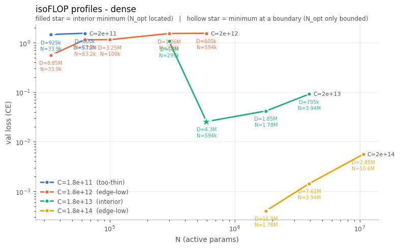
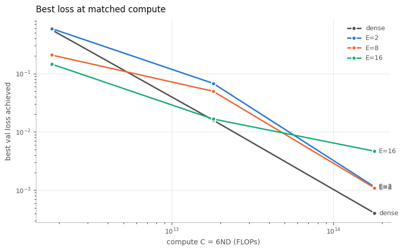
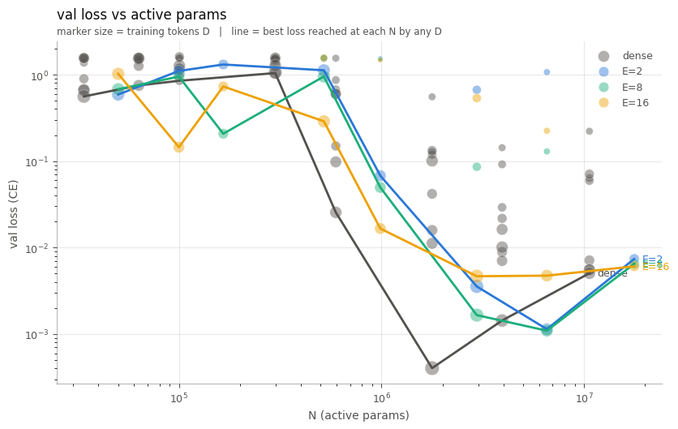

# Scaling laws on 3-digit addition: dense and mixture-of-experts

A technical report on the scaling-law experiments in this repo — what was measured,
what it means, what was wrong along the way, and what remains open.

## Summary

3-digit addition has **no Chinchilla-style scaling law** in the range we can train.
It has a **capability threshold** near 600k active parameters: below it models fail
regardless of data, above it they solve the task within about one decade of compute.
The five-parameter surface `L = E + A/N^α + B/D^β` is not merely hard to fit here —
we show it is *unidentifiable* at our noise level even on synthetic data drawn from
a perfect surface.

Against that backdrop, mixture-of-experts **helps only when capacity-starved**. At
the lowest compute budget E=16 beats dense by ~3.7×; at the highest, dense beats
every MoE arm. The arms cross. This is consistent with Mixture of Parrots (experts
aid memorization, not reasoning) — with an important caveat: our MoE config costs
1.67× the active parameters of dense at the same architecture shape, so part of the
high-compute deficit is a handicap we imposed, not a property of routing.

---

## 1. Setup

**Task.** Reversed-answer 3-digit addition (`123+456=975`), ~999,900 non-trivial
operand pairs, ~4.5 supervised tokens per example. Both-single-digit pairs are
excluded as fundamentals. Train pool after the val carve: **4,394,147 supervised
tokens**.

**Model.** Decoder-only transformer: MHA, SwiGLU FFW, RMSNorm, learned position
embeddings, tied input/output embedding. The MoE variant replaces the dense FFW with
top-k routed experts (`jax.lax.ragged_dot`, sorted dispatch, load-balance aux loss).
Dense and MoE share one code path, selected by `cfg.num_experts == 0`.

**N is active parameters**, not total:

```
N = 3·L·D·F·K   +   4·D·H·L   +   2·D·V
    ffw (K=top_k)    attn (H=heads·key_dim)   tied embed
```

Dense `(d_model=384, L=6)` = **10,629,120**. At `E=8, k=2` the MoE has 60,197,760
total parameters but 17,707,008 active — **5.7× apart**. Using total params in `6ND`
would have made the arms incomparable.

**Compute accounting.** `C = 6ND` throughout, with N active. Reasonable for MoE
since only `top_k` experts run per token.

**Training performed.**

| | runs | optimizer steps | FLOPs |
|---|--:|--:|--:|
| dense 8×8 (N, D) grid, 1 seed | 64 | 109,120 | 1.64e15 |
| dense multi-epoch infill | 4 | 37,708 | 3.80e14 |
| MoE isoFLOP design, E ∈ {2, 8, 16} | 36 | 100,128 | 1.86e15 |
| **total** | **104** | **246,956** | **3.88e15** |

An earlier dense sweep (~30 runs) is excluded: its conclusions were void once the
fitter bug in §5.1 was found, and only 27 of its rows survived — recovered by parsing
stored notebook output, since rows were not being persisted at the time.

**Ladders.** N: 8 rungs, 33,728 → 10,629,120 active (2.5 decades), heads scaled with
`d_model`, `key_dim` pinned at 64. D: 8 rungs, 600k → 4.3M supervised tokens (0.86
decades, capped by the pool). MoE: `top_k = 2` fixed, `E ∈ {2, 8, 16}`, compute
budgets `C ∈ {1.8e12, 1.8e13, 1.8e14}`.

---

## 2. Results

### 2.1 A capability threshold near 600k active parameters

The decisive measurement is an isoFLOP profile at `C = 1.8e13` — same compute, split
differently:

| N | D (sup tokens) | epochs | val loss |
|--:|--:|--:|--:|
| 298,656 | 10,045,002 | 2.3 | ~1.5 |
| **594,432** | **4,300,000** | 1.0 | **0.027** |
| 1,777,344 | 1,850,000 | 0.4 | 0.042 |
| 3,940,608 | 795,000 | 0.2 | 0.095 |

The 298k model received **2.3× more data** and still landed at the guessing plateau —
55× worse. That is not a model marginally short on capacity trading against data; it
is a model that cannot learn the algorithm at all.

Reference points: uniform over vocabulary = 2.77 nats, unigram = 2.27,
**position-conditional unigram = 1.7883**. Anything near 1.5 has learned the output
format, not arithmetic.



*Fig 1 — isoFLOP profiles for the dense arm, four compute budgets. Moving right spends
the budget on parameters instead of tokens; each point is labelled with the D it bought.
A filled star marks a located minimum, hollow marks one only bounded. Of the four bands,
1.8e11 is too thin to classify, 1.8e12 and 1.8e14 are `edge-low`, and **only C=1.8e13
has an interior minimum** — at N=594,432 with D=4.3M.*

### 2.2 Three compute regimes, spanning about one decade

| band | losses | verdict |
|---|---|---|
| C = 1.8e12 | 0.58 → 1.6 | guessing plateau |
| **C = 1.8e13** | **0.027 → 0.095** | the only usable band |
| C = 1.8e14 | 4e-4 → 6e-3 | solved |

A Chinchilla fit needs several decades of smooth power-law behaviour. The entire
interesting range of this task is about **one decade of compute**.

### 2.3 Below the threshold, data beats parameters everywhere

At `C = 1.8e12` the *smallest* model (N=33,888, 8.85M tokens, 2 epochs) beat every
larger model in its band — 0.58 vs 1.2–1.6. Measured `D/N` ratios ran 16.3 down to
0.1; Chinchilla-optimal is ~20 tokens/param, so most of the grid was data-starved.

Consequently most isoFLOP bands are `edge-low`: the optimum sits at or below the
smallest model tested, and `N_opt` is bounded rather than located.

### 2.4 MoE helps only when capacity-starved

Best loss reached by each arm at matched compute:

| C | dense | E=2 | E=8 | E=16 |
|--:|--:|--:|--:|--:|
| 1.8e12 | 0.55 | 0.60 | 0.20 | **0.15** |
| 1.8e13 | **0.016** | 0.068 | 0.050 | 0.017 |
| 1.8e14 | **4e-4** | 1.2e-3 | 1.1e-3 | 4.7e-3 |

The arms **cross** near C ≈ 4e13. At the lowest budget E=16 beats dense by 3.7×,
which exceeds the noise floor; at the highest, dense wins by ~10× over E=16.



*Fig 2 — best loss achieved per arm at each compute budget. Reads the envelope's
value, never its position, so it is robust to the run-to-run noise that defeats the
surface fit. The E=16 line is visibly flatter than the others: it starts lowest and
ends highest.*

The same crossover appears in N: at N ≈ 1e5, E=16 reaches ~0.15 where dense is ~1.0.



*Fig 3 — every cell against active parameters. Marker size encodes the token budget
(necessary: on an isoFLOP design, moving right in N also means moving down in D).
Solid lines are per-arm lower envelopes — best loss reached at each N by any D.*

Two features of Fig 3 need care. The MoE envelopes are **jagged** below N ≈ 5e5 — the
E=16 line swings 1.0 → 0.15 → 0.7 → 0.2 across adjacent rungs — which is the bimodal
plateau escape of §3.2, not structure. And every envelope **turns back up** at large N,
because those cells are the data-starved right arm of their isoFLOP band, not because
capacity hurts.

### 2.5 The MoE arm carries a 1.67× handicap

With `top_k = 2` and **full-width** experts, the same architecture shape costs:

| shape | dense N | moe N (k=2) | ratio |
|---|--:|--:|--:|
| 128, 3 | 593,536 | 986,368 | 1.66× |
| 384, 6 | 10,629,120 | 17,707,008 | 1.67× |

So the arms sit on different N grids (dense 33,728 → 10.6M; MoE 50,048 → 17.7M).
Because the optimum is at the low-N edge, the arm that reaches lower N buys more
tokens: at C=1.8e12, dense reaches 8.9M tokens where MoE reaches 6.0M.

**Part of "dense wins at high compute" is this handicap, not routing.** It is also
not intrinsic to MoE — [Krajewski et al.](https://arxiv.org/abs/2402.07871) find that
sizing experts to mirror the FF layer is suboptimal at essentially any budget. Setting
expert width to `F/k` would equalise active parameters and isolate the routing effect.

A second asymmetry compounds it. The dense arm's winning cell at C=1.8e14 — the 4e-4
point, and the deep minimum in Fig 3 — is **N=1,777,344 trained for 3.8 epochs** (D=16.9M),
a multi-epoch infill cell. The best any MoE arm could reach at that budget was
N=2,955,264 at **2.3 epochs**, because its N grid bottoms out higher. So at the top
budget dense is compared against MoE while holding both more tokens and more repeats.
The two effects share one cause (the 1.67× N offset), but it means the high-compute
gap in Fig 2 is an upper bound on any real dense advantage, not a measurement of it.

---

## 3. Why no scaling law fits

### 3.1 Two regimes in N, not one

Regressing `log L` on `log D` at fixed N across all 8 data rungs:

| group | weighted β | χ²/dof |
|---|--:|--:|
| N ≤ 298,656 | **0.15 ± 0.05** | 0.70 (consistent) |
| N ≥ 594,432 | **1.34 ± 0.25** | 0.24 (consistent) |

Each group is internally consistent with a single β; the two differ by 9×. Below the
threshold data barely helps; above it, it helps enormously. `E + A/N^α + B/D^β`
describes one smooth regime and cannot represent a switch.

β ≈ 1.34 is also far steeper than the ~0.3 typical of language models — the loss falls
too fast for a power law to hold over any useful range.

### 3.2 Run-to-run noise exceeds the effect

| N | resid sd (log-loss) | loss varies by |
|--:|--:|--:|
| 298,656 | 0.118 | ±1.13× |
| 594,432 | 0.847 | ±2.33× |
| 1,777,344 | 0.918 | ±2.50× |
| 3,940,608 | 0.508 | ±1.66× |

Identical configurations differ by up to 2.5×. Cause: whether a run escapes the
plateau within its step budget is partly stochastic, so cells near the threshold are
bimodal (≈1.55 *or* ≈0.7, nothing between).

### 3.3 The parameters are unidentifiable — demonstrated

We generated synthetic data from a **known-perfect Chinchilla surface** (α=0.34,
β=0.37) on our exact grid (4 N × 8 D) with our measured noise (sd 0.5):

| parameterisation | α CI (true 0.34) |
|---|---|
| as written | [0.56, 16.73] |
| centered predictors | [−4.66, 18.08] |
| centered, E fixed to 0 | [−3.36, 18.63] |

No regime edges, no plateau, no saturation — α still unrecoverable. **The problem is
not the task, the ladders, the filter, or the fitter.**

The fit on real data returned `A = 6.58e13 [17.8, 1.35e90]`, `α = 2.434 [0.499,
15.64]`, `β = 3.585 [1.156, 16.2]` — a degenerate ridge where only `A·N^(−α)` is
constrained. The bootstrap distribution of α is visibly **bimodal**, with ~¼ of
resamples in a high-α basin and at least one negative sample: the optimizer lands in
two different basins depending on which cells a resample includes.

---

## 4. Method notes

**The three-regime structure is standard.** Loss goes random-guessing → power law →
irreducible floor; the Chinchilla form describes only the middle. `select_fit_range`
excludes both ends explicitly and prints what it dropped: `guessing` (≥90% of the
position-unigram baseline), `saturated` (≤3× the floor), `undertrained` (<500 steps),
`capacity-limited` (N below threshold).

**A rectangular (N, D) grid makes diagonal isoFLOP lines.** Extreme compute bands
therefore hold one or two models by construction — at C=1.8e14 only the 10.6M model
could participate; a 594k model would need 11.5 epochs. This is geometry, not a data
problem, and it is why a **direct isoFLOP design** (choose C, derive `D = C/(6N)`) is
strictly better: fewer runs, less compute, every cell exactly on a band.

**Multi-epoch repeats extend the design, not the data axis.** At fixed N, more D
pushes into saturation. At **fixed C**, more D reaches *smaller* N — which is where
the missing left arm of the U lives. Capped at 4 epochs, past which repeated tokens
are worth measurably less ([Muennighoff et al.](https://arxiv.org/abs/2305.16264)).
Filling the thin bands cost 4 runs and 23% of the original grid.

**Compute is concentrated.** The largest N rung is 61% of a grid sweep; the smallest
four together are 2.8%. Run *count* is a poor proxy for cost.

**Fitting is CPU-bound and does not move to an accelerator.** `scipy` finite-
differencing over 30 numbers is dispatch overhead.

---

## 5. Wrong turns

Each cost a sweep or a rebuild; recorded so they are not repeated.

**Warmup as the explanation for the 1.55 plateau.** Warmup fraction correlated
beautifully with loss (58%, 23%, 10%, 5%, 5%, 5% vs 1.63, 1.55, 0.62, 0.14, 0.045,
0.048) — but both track D, so the correlation was confounded. Fixing warmup moved the
D=100k loss from 1.6321 to 1.6307. The fix was worth keeping for the crash; the
hypothesis was wrong.

**Adding smaller models to fix α.** They landed in the *guessing* regime (β = 0.15)
and had to be filtered back out of the surface fit. They later proved essential as the
left arm of the isoFLOP U — but that was luck, not the plan.

**A diagnostic too noisy to diagnose.** `local_beta` compared adjacent D rungs; with
1.32× spacing, noise of 0.2 in log-loss gives β error of ±1.0. It reported "NOT
constant" everywhere, including on clean data. Densifying the D ladder made it *worse*.
Regressing across all 8 rungs at once (±0.12) revealed the two-regime structure.

**Dismissing the 4-epoch idea.** Evaluated as "extend D at fixed N" (pushes into
saturation) rather than at fixed C (reaches smaller N). That reframing produced the
interior minimum in §2.1.

**Compute budgets inherited from grid geometry.** `C_TARGETS` came from binning the
dense grid's C range. Judged against what that grid then showed, only 1.8e13 lands
inside the measurable window — 1.8e12 is plateau and 1.8e14 is saturated, so two of
three MoE budgets tell us little. `[3e12, 8e12, 2e13]` would keep all three usable.

**Estimates quoted from the wrong context.** A "~100×" predicted speedup measured
4.2×; a "~5 minute" bootstrap benchmarked on clean data on a laptop ran 20+ minutes on
noisy data on a Colab host.

---

## 6. Interpretation

**For this task.** 3-digit addition is learned discretely. There is a threshold near
600k active parameters; below it more data does not help, above it the task is solved
within a decade of compute. "Compute-optimal model size" collapses to "the smallest
model that can represent the algorithm" — a capability threshold, not a params-vs-data
trade-off. This is a legitimate negative result about **when scaling laws apply**.

**For MoE.** Extra experts help below the width threshold and hurt above it. The
practical reading: MoE buys capacity, and capacity is only the binding constraint when
you are short of it. On a task whose difficulty is a width threshold rather than a
breadth-of-knowledge problem, routing cannot substitute for width — which is exactly
the Mixture of Parrots claim, reproduced here on a clean algorithmic threshold.

**Caveat.** Our MoE is 1.67× more expensive per token at the same shape (§2.5), so the
high-compute comparison is not clean. A granularity-matched arm would settle it.

---

## 7. Open questions

- **Threshold or trade-off?** One located minimum (N_opt = 594,432 at C=1.8e13). If a
  threshold, N_opt stays put across budgets; if a real trade-off, it marches right.
  Infilling C=5e12 and C=5e13 would bracket it. Highest-value follow-up.
- **Is the threshold representational or optimisation-limited?** A model that *can*
  represent addition but does not find it within its step budget looks identical to one
  that cannot. Multiple seeds at N=298,656 would distinguish them.
- **Granularity-matched MoE.** Set expert width to `F/k` so active parameters match
  dense at the same shape, removing the 1.67× handicap.
- **Would seeds make the surface fittable?** §3.3 says not at sd 0.5. The synthetic
  probe could be re-run at sd 0.2 and 0.1 to price the answer before spending compute.

---

## 9. Reproducing

**Files.** `model.py` (dense + MoE, flag is `cfg.num_experts`), `config.py`,
`utils.py` (`active_params`, `check_param_formula`), `chinchilla_laws_dense.ipynb`,
`chinchilla_laws_moe.ipynb`.

**MoE notebook cell order:** `0–2` setup → `6–11` Part 2 constants, pool, param
counting, training, ladders, isoFLOP machinery → `12` run the sweep + save →
`13` reload → `14` fit range (+ load the dense control) → `15` isoFLOP analysis →
`17–26` surface fit, per-E fits, `A(E)`, frontier.

**Current settings.** `SEEDS = (0,)`, `MIN_N = 500_000` (surface fit only — isoFLOP
deliberately uses all rungs), `MAX_EPOCHS = 4.0`, `E_LADDER = [2, 8, 16]`,
`top_k = 2`, `C_TARGETS = [1.8e12, 1.8e13, 1.8e14]`.

**Data.** `rows_dense_*.json` and `rows_moe_*.json` in `MyDrive/scaling-book`, each
`{rows, D_ceiling, tag, stamp}`. Arms are tagged `n_experts`; `rows` is kept
single-arm and merged only at analysis time (`all_rows`).

**Sanity checks that should hold.** `check_param_formula` on a dense config returns a
delta of 4,992 (norm gammas + pos_embed, excluded by design). Dense `(64, 2)` =
100,096 active params. `fit_surface` on a clean synthetic surface recovers α=0.3593,
β=0.3734 against true 0.34/0.37 with CIs of roughly ±0.04.

**Regenerating the figures.** The plot functions call `plt.show()`, which clears the
figure, so shadow it before calling:

```python
import matplotlib.pyplot as plt, os
os.makedirs('figures', exist_ok=True)
_show = plt.show

def _to(path):
    plt.show = lambda *a, **k: plt.savefig(path, dpi=130, bbox_inches='tight')

_to('figures/dense-lossvsparams.png')
plot_isoflop(rows_where(all_rows, 0), title="isoFLOP profiles - dense")

_to('figures/lossvscompute.png')
plot_best_loss(best_loss_vs_compute(all_rows, centres=C_TARGETS))

_to('figures/lossvsactiveparams.png')
plot_loss_vs_N(all_rows)

plt.show = _show
```
